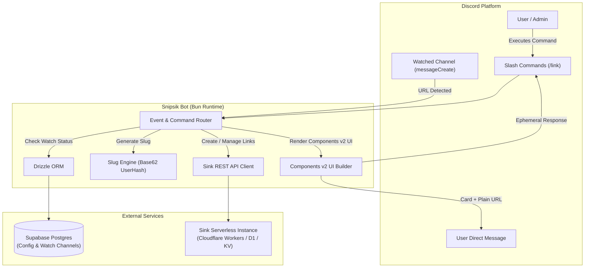

# Snipsik 아키텍처 및 배포 가이드 (Architecture & Deployment)

## 1. 시스템 구성도



---

## 2. 프로젝트 디렉토리 구조

모든 소스 코드는 `src/`에 위치하며, 절대 경로 별칭(`@/*`)을 사용합니다.

```
Snipsik/
├── Dockerfile                  # oven/bun Multi-stage Dockerfile
├── docker-compose.yml          # Docker Compose 배포 설정
├── .dockerignore
├── .env.example                # 환경 변수 템플릿
├── drizzle.config.ts           # Drizzle Kit 설정
├── package.json                # Bun 패키지 정의 및 스크립트
├── tsconfig.json               # strict: true, paths: {"@/*": ["src/*"]}
├── docs/                       # 전체 문서
│   ├── README.md               # 문서 인덱스
│   ├── SPECIFICATION.md        # 기능 및 명령어 상세 사양서
│   └── ARCHITECTURE.md         # 시스템 아키텍처 및 배포 가이드
└── src/
    ├── index.ts                # 봇 초기화 및 클라이언트 로그인 진입점
    ├── config.ts               # Zod 기반 strict 환경변수 파싱 및 검증
    ├── db/
    │   ├── index.ts            # Drizzle ORM Supabase 클라이언트 연결
    │   └── schema.ts           # Config 및 Watch Channels 테이블 스키마
    ├── types/
    │   ├── sink.ts             # Sink API 엄격한 TypeScript 인터페이스
    │   └── bot.ts              # Command, Modal, Button, Component 타입 정의
    ├── services/
    │   ├── sinkClient.ts       # Sink REST API 통신 클라이언트 (Fetch 기반)
    │   ├── slugManager.ts      # Slug 생성, 유저 해시 인코딩, 커스텀 슬러그 권한 검증기
    │   ├── userConfigService.ts# 유저별 감시 오버라이드 및 DM 포맷 설정 캐시/CRUD/본문 치환
    │   └── watchService.ts     # Drizzle ORM 기반 Watch 채널 캐시 및 CRUD
    ├── events/
    │   ├── ready.ts            # 봇 구동 및 슬래시 커맨드 등록
    │   ├── interactionCreate.ts# 슬래시 커맨드, 모달, 버튼, 셀렉트 메뉴, Autocomplete 라우터
    │   └── messageCreate.ts    # URL 감지 -> 유저 오버라이드 필터링 -> 자동 단축 -> 본문 치환 DM 발송
    ├── commands/
    │   └── link.ts             # /link [dashboard|config|create|custom|list|stats|delete|check]
    └── utils/
        ├── logger.ts           # 콘솔 컬러 로거
        ├── ui.ts               # 100% Components v2 기반 메시지 레이아웃 빌더
        └── modals.ts           # 링크 생성/수정용 Discord Modal 빌더
```

---

## 3. 환경 변수 레퍼런스 (`.env`)

| 환경 변수명          | 필수 여부 |         기본값         | 설명                                                      |
| :------------------- | :-------: | :--------------------: | :-------------------------------------------------------- |
| `DISCORD_TOKEN`      | **필수**  |           -            | 디스코드 봇 토큰                                          |
| `DISCORD_CLIENT_ID`  | **필수**  |           -            | 디스코드 봇 애플리케이션 ID                               |
| `DATABASE_URL`       | **필수**  |           -            | Supabase PostgreSQL 연결 문자열 (`postgresql://...`)      |
| `SINK_BASE_URL`      | **필수**  | `https://s.japsik.com` | 배포된 Sink 인스턴스 도메인 주소                          |
| `SINK_API_TOKEN`     | **필수**  |           -            | Sink 인스턴스의 `NUXT_SITE_TOKEN` (API Bearer 인증용)     |
| `RANDOM_SLUG_LENGTH` |   선택    |          `3`           | 일반 링크 생성 시 앞자리 랜덤 문자열 길이 (2~16)          |
| `ADMIN_USER_IDS`     |   선택    |          `""`          | `/link custom` 생성이 허용된 디스코드 유저 ID (콤마 구분) |

---

## 4. 데이터베이스 스키마 (Drizzle ORM)

```typescript
// watch_channels 테이블 (감시 대상 채널)
export const watchChannels = pgTable("watch_channels", {
  id: serial("id").primaryKey(),
  guildId: text("guild_id").notNull(),
  channelId: text("channel_id").notNull(),
  createdBy: text("created_by").notNull(),
  createdAt: timestamp("created_at", { withTimezone: true })
    .defaultNow()
    .notNull(),
});

// user_configs 테이블 (유저별 감시 오버라이드 및 DM 포맷 설정)
export const userConfigs = pgTable("user_configs", {
  userId: text("user_id").primaryKey(),
  autoDmMode: text("auto_dm_mode").default("inherit").notNull(), // 'inherit' | 'on' | 'off'
  dmFormat: text("dm_format").default("replace").notNull(), // 'replace' | 'list'
  createdAt: timestamp("created_at", { withTimezone: true })
    .defaultNow()
    .notNull(),
  updatedAt: timestamp("updated_at", { withTimezone: true })
    .defaultNow()
    .notNull(),
});

// guild_configs 테이블 (서버별 부가 설정)
export const guildConfigs = pgTable("guild_configs", {
  guildId: text("guild_id").primaryKey(),
  autoShortenEnabled: boolean("auto_shorten_enabled").default(true).notNull(),
  createdAt: timestamp("created_at", { withTimezone: true })
    .defaultNow()
    .notNull(),
  updatedAt: timestamp("updated_at", { withTimezone: true })
    .defaultNow()
    .notNull(),
});
```

---

## 5. Docker 배포 가이드

### 5.1 Dockerfile (`oven/bun:1-alpine`)

Multi-stage 빌드를 통해 이미지 용량을 최소화하고 보안을 위해 `bun` 비루트 사용자로 구동합니다.

```dockerfile
# Build Stage
FROM oven/bun:1-alpine AS builder
WORKDIR /app
COPY package.json bun.lock* ./
RUN bun install --frozen-lockfile
COPY tsconfig.json ./
COPY src/ ./src/
RUN bun build src/index.ts --outdir dist --target bun

# Production Stage
FROM oven/bun:1-alpine AS runner
WORKDIR /app
ENV NODE_ENV=production
COPY package.json bun.lock* ./
RUN bun install --production --frozen-lockfile
COPY --from=builder /app/dist ./dist
USER bun
CMD ["bun", "run", "dist/index.js"]
```

### 5.2 실행 방법

1. `.env` 파일 생성 및 환경 변수 설정
2. DB 스키마 푸시:
   ```bash
   bun run db:push
   ```
3. Docker Compose 빌드 및 백그라운드 실행:
   ```bash
   docker compose up -d --build
   ```
4. 로그 확인:
   ```bash
   docker compose logs -f snipsik
   ```
